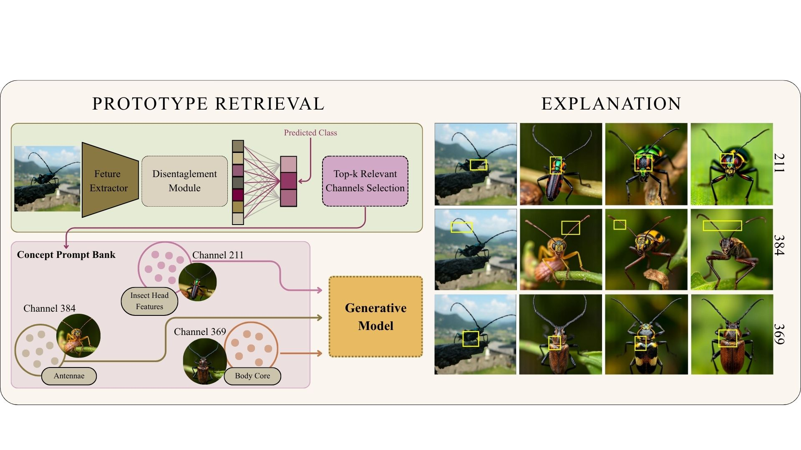

# ProDG: Prototypes for Data-Free Generative Post-Hoc Explainability
Piotr Borycki, Magdalena Trędowicz, Jacek Tabor, Łukasz Struski, Przemysław Spurek

This repository contains the official authors implementation associated
with the paper ["ProDG: Prototypes for Data-Free Generative Post-Hoc Explainability"](https://arxiv.org/abs/2605.08858).

Abstract:

Ante-hoc interpretability methods based on prototypes provide highly accurate explanations by utilizing the intuitive "this looks like that" reasoning paradigm. On the other hand, post-hoc models can explain predictions for a single image without relying on an underlying dataset or requiring costly neural network retraining. Recent approaches successfully solve the retraining problem for prototype-based networks. However, they still face a fundamental limitation: they require access to a subset of data (e.g., a test or validation set) to search for and extract the visual prototypes. In this paper, we address this issue and introduce ProDG: Generative Prototypes for Data-Free Post-Hoc Explainability, a novel framework that leverages generative models to synthesize pure, high-fidelity prototypes directly from the frozen model's weights, completely eliminating the dependency on any external data. By establishing this new frontier in Data-Free XAI, ProDG unlocks robust visual interpretability for privacy-sensitive domains, where original data is strictly restricted or fundamentally inaccessible.



# Installation

The following installation instructions are provided for a Conda-based Python environment.

### Clone the Repository

```shell
# SSH
git clone git@github.com:piotr310100/ProDG.git
```
or
```shell
# HTTPS
git clone https://github.com/piotr310100/ProDG.git
```
### Environment
To install
```bash
# Create and activate the environment
conda create -y -n ProDG python=3.13
conda activate ProDG

# Install PyTorch
# To install with CUDA (if you have a compatible GPU), uncomment ONE of the following:

# For CUDA 12.8:
# pip install torch==2.7.1 torchvision==0.22.1 --index-url https://download.pytorch.org/whl/cu128

# For CUDA 12.6:
# pip install torch==2.7.1 torchvision==0.22.1 --index-url https://download.pytorch.org/whl/cu126

# For CUDA 11.8:
# pip install torch==2.7.1 torchvision==0.22.1 --index-url https://download.pytorch.org/whl/cu118

# Otherwise, install CPU-only version:
pip install torch==2.7.1 torchvision==0.22.1 --index-url https://download.pytorch.org/whl/cpu

# Install other dependencies
pip install -r requirements.txt
```
# Datasets
We evaluate **ProDG** on four widely used benchmarks to assess its interpretability and generalization across a diverse range of domains and visual granularities:

- **ImageNet (ILSVRC-2012)**
  A large-scale benchmark consisting of over 1.2 million images labeled across 1,000 object categories. ImageNet serves as the primary testbed for evaluating the global behavior of pretrained networks and the scalability of ProDG on complex, real-world visual concepts.

- **Stanford Cars**
  A fine-grained dataset containing 16,185 images of 196 car classes. This benchmark is used to assess ProDG’s ability to localize class-representative prototypes within tightly clustered visual domains.

- **Stanford Dogs**
  A dataset comprising 20,580 images spanning 120 dog breeds. Given the high intra-class variability and subtle inter-class differences, this dataset is ideal for testing ProDG's robustness and semantic alignment in explaining subtle visual distinctions.

- **CUB-200-2011**
  A fine-grained bird species dataset with 11,788 images across 200 categories. We use CUB to further validate ProDG’s capacity to extract semantically meaningful and localized prototypes in challenging, high-resolution, biologically diverse settings.

All datasets are used in accordance with their respective licenses. For experimental reproducibility, we follow the official train/test splits and preprocessing pipelines as described in their original publications.

We also include `.json` files in `class_id_to_name` subdirectory for each of the above dataset with corresponding class list used by our model during initialization.

## Datasets structure

This project expects image datasets to follow the structure required by `torchvision.datasets.ImageFolder`:

```bash
dataset_root/
├── class_0/
│   ├── image1.png
│   ├── image2.png
│   └── ...
├── class_1/
│   ├── image3.png
│   ├── image4.png
│   └── ...
└── ...
```

For more details refer to PyTorch documentation of [ImageFolder](https://docs.pytorch.org/vision/stable/generated/torchvision.datasets.ImageFolder.html#imagefolder).

# Running the code

### Configuration

This project uses [Hydra](https://hydra.cc) YAML configs to define all training and evaluation settings.

All configs can be found in the [`configs/`](./configs) folder:

- `configs/config_base.yaml ` — base config containing overlapping parameters (e.g. model name)
- `configs/config_train_generative.yaml` — for training the prototype disentanglement module.
- `configs/config_explain_generative.yaml` — for generating explanations on validation samples.

### Example Commands

We provide example configs for training Disentanglement Module on ResNet34 and ImageNet dataset.

Make sure you run the commands from the project root directory.

To train using the default configuration:
```bash
# Train with base values included in the config_train.yaml
python src/main.py --config-name config_train_generative
```

To change the model and save directory (e.g., use ResNet50):
```bash
python src/main.py --config-name config_train_generative model.name resnet50 output_path outputs/resnet50
```

To generate explanations for random images from the validation set:
```bash
python src/main.py --config-name config_explain_generative
```

**Note**: Ensure you have trained and saved model outputs in the specified output_path before running explanations.

# Citations

<section class="section" id="BibTeX">
  <div class="container is-max-desktop content">
    <h2 class="title">BibTeX</h2>
<h3 class="title">ProDG: Prototypes for Data-Free Generative Post-Hoc Explainability</h3>
    <pre><code>@misc{borycki2026prodg,
      title={ProDG: Prototypes for Data-Free Generative Post-Hoc Explainability},
      author={Piotr Borycki and Magdalena Trędowicz and Jacek Tabor and Łukasz Struski and Przemysław Spurek},
      year={2026},
      eprint={2605.08858},
      archivePrefix={arXiv},
      primaryClass={cs.CV},
      url={https://arxiv.org/abs/2605.08858},
}
</code></pre>
</section>
